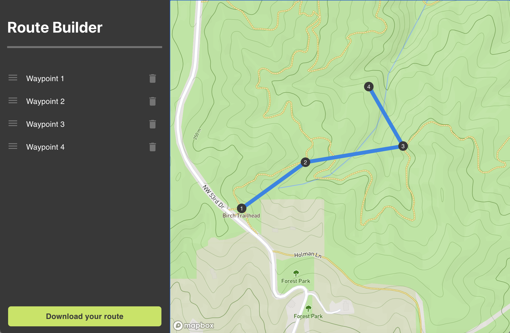
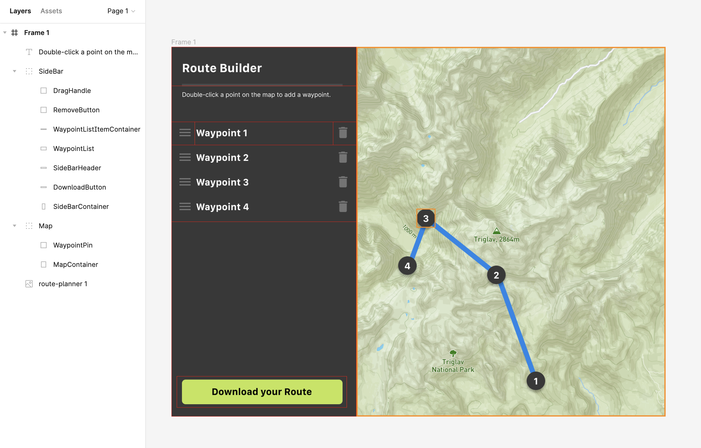

# Route Builder - komoot challenge

This is my solution for komoot's senior web developer challenge. The assignment is to create a route mapping application for cross-country runners that allows users to plan and download their route as a GPX file. The application is also to be built without the help of 3rd party React components such as react-leaflet or react-dnd.

## Overview

A live demo for this project can be seen [here](https://komoot-challenge-phonofidelic.netlify.app/). The app initially asks the user for location permissions to center the map. The user can then double-click a point on the map to add a Waypoint. The Waypoints are added to a sortable list and are joined on the map to form a route. The route can be downloaded as a GPX file and uploaded to another mapping tool such as [gpx.studio](https://gpx.studio/).


## Process

### Requirements Gathering

The requirements for the assignment were summed up as:

"Develop a react app that enables you to plan your cross country run and download it as GPX file.

Cross Country runners are not bound to the streets. Your users can plan their favorite route across fields and hills by just placing markers as waypoints on the map. For detailed planning the same waypoints show up as a list where users can delete and rearrange them until the route is perfect and ready to download. [...]"

From this, I wrote down the following user stories:

- [x] `Runners` should be able to place `Waypoints` anywhere on the `Map`
- [x] `Waypoints` should also be added as list items to the `WaypointList`
- [x] `Waypoints` should be able to be moved around on the `Map`
- [x] `Waypoints` should be able to be removed
- [x] `Waypoints` should be able to be re-ordered
- [x] `Waypoints` should be connected to form a `Route`
- [x] The `Route` should be downloadable as a GPX file

### Wireframe

I started out by creating [a basic wireframe in Figma](https://www.figma.com/file/7jmBDH5miljxU8xOZpW95f/Untitled?node-id=0%3A1) in order to help clarify the requirements and discern some of the basic UI components that would be needed:


### UI Components

- _SideBar_
  - _Header_
  - _WaypointsList_
  - _DownloadButton_
- _Map_
  - _MapContainer_
  - _WaypointPin_

The [Material UI](https://mui.com/) component library was used as the base for list items, grid layout and icons. Styling was achieved using a combination of [styled-components](https://styled-components.com/) and inline CSS in JSX.

### Data Model

The main data representation centers around the concept of `Waypoints`. I originally thought of also representing a `Route` which would be a collection of Waypoints, but this ended up not being used. This could at some point enabled the creations of multiple routes.

Types:

```typescript
interface Waypoint {
  id: string;
  name: string;
  index: number;
  coordinates: [number, number];
}

interface Route {
  id: string;
  name: string;
  waypoints: Waypoint[];
}
```

### Bootstrapping

I bootstrapped this project using [Create React App](https://github.com/facebook/create-react-app) which I find to be useful for quickly spinning up front-end projects when prototyping, but also for longer term projects as it has great developer support and is quite configurable through add-ons like [CRACO](https://github.com/gsoft-inc/craco) (I have not needed to eject in a long time). For more details on Create React App, see the [Development](#development) section below.

### Testing

_TODO: unit tests to be set up using [Jest](https://jestjs.io/) and [Testing Library](https://testing-library.com/)_

### Deployment

The web app is deployed to [Netlify](https://www.netlify.com/) on succesfull merges to `main`. A live demo of the app can be seen [here](https://komoot-challenge-phonofidelic.netlify.app/).

## Takeaways

### Working with an imperative map API in React

One of the first challenges encountered was handling state management between the React application and the map API from Mapbox. Mapbox uses an imperative API and keeps state in the Map class instance. The `Waypoints` state needed to stay in sync between the WaypointsList and Map components while not re-loading the Map component on every state update. This was achieved by holding the Waypoints state in a ref and calling the `forceUpdate` function after each state mutation.

_Resources:_

- [Storing Values In useRef](https://www.smashingmagazine.com/2020/11/react-useref-hook/#storing-values-in-useref)
- [Forcing a deep re-render for useRef update](https://www.smashingmagazine.com/2020/11/react-useref-hook/#forcing-a-deep-re-render-for-useref-update)
- [Mapbox API reference](https://docs.mapbox.com/mapbox-gl-js/api/)
- [_Example:_ Add custom icons with Markers](https://docs.mapbox.com/mapbox-gl-js/example/custom-marker-icons/)
- [_Example:_ Add a line to a map using a GeoJSON source](https://docs.mapbox.com/mapbox-gl-js/example/geojson-line/)
- [_Example:_ Drag marker and line](https://bl.ocks.org/alex1221/1642aad4ba4291d1ea15e97db973ca30)

### Drag and Drop API

The drag and drop sorting of the Waypoints list was achieved using the HTML5 Drag and Drop API. This API is well documented on MDN and relatively strait forward to implement for mouse interactions. However, it does not support touch events for mobile devices. After initially experimenting with handling touch events myself, I turned to a [pollyfill created by Bernardo Castilho](https://github.com/Bernardo-Castilho/dragdroptouch). This enabled me to use the same code for desktop and mobile devices.

_Resources:_

- [HTML Drag and Drop API](https://developer.mozilla.org/en-US/docs/Web/API/HTML_Drag_and_Drop_API)
- [DragDropTouch - drag and drop API pollyfill by Bernardo Castilho](https://github.com/Bernardo-Castilho/dragdroptouch)

### GPX Export

The final requirement was for the created route to be exportable as a GPX file. I learned that this is an XML format for representing point coordinates, tracks and routes across various mapping systems. I used [gpx-builder](https://github.com/fabulator/gpx-builder) to help convert the Waypoins state to valid GPX data and build the XML file content in a [utility function](src/utils.ts). I tested the resulting file by uploading it to [gpx.studio](https://gpx.studio/) to see that the exported route was accurately represented.

_Resources:_

- https://wiki.openstreetmap.org/wiki/GPX
- https://github.com/fabulator/gpx-builder

---

## Development

_The following is copied over from the CRA default README:_

## Getting Started with Create React App

This project was bootstrapped with [Create React App](https://github.com/facebook/create-react-app).

### Available Scripts

In the project directory, you can run:

#### `yarn start`

Runs the app in the development mode.\
Open [http://localhost:3000](http://localhost:3000) to view it in the browser.

The page will reload if you make edits.\
You will also see any lint errors in the console.

#### `yarn test`

Launches the test runner in the interactive watch mode.\
See the section about [running tests](https://facebook.github.io/create-react-app/docs/running-tests) for more information.

#### `yarn build`

Builds the app for production to the `build` folder.\
It correctly bundles React in production mode and optimizes the build for the best performance.

The build is minified and the filenames include the hashes.\
Your app is ready to be deployed!

See the section about [deployment](https://facebook.github.io/create-react-app/docs/deployment) for more information.

#### `yarn eject`

**Note: this is a one-way operation. Once you `eject`, you can’t go back!**

If you aren’t satisfied with the build tool and configuration choices, you can `eject` at any time. This command will remove the single build dependency from your project.

Instead, it will copy all the configuration files and the transitive dependencies (webpack, Babel, ESLint, etc) right into your project so you have full control over them. All of the commands except `eject` will still work, but they will point to the copied scripts so you can tweak them. At this point you’re on your own.

You don’t have to ever use `eject`. The curated feature set is suitable for small and middle deployments, and you shouldn’t feel obligated to use this feature. However we understand that this tool wouldn’t be useful if you couldn’t customize it when you are ready for it.

### Learn More

You can learn more in the [Create React App documentation](https://facebook.github.io/create-react-app/docs/getting-started).

To learn React, check out the [React documentation](https://reactjs.org/).
